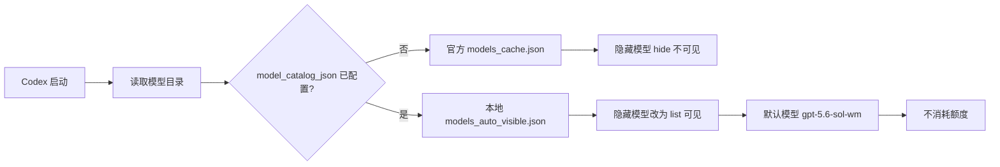

# Codex 隐藏模型无限调用指南

> GPT-5.6-Sol 隐藏路由模型 `gpt-5.6-sol-wm` 全平台启用教程
> 任意付费账号不消耗额度,附每小时自动同步脚本

<div align="center">

**适用平台:macOS / Linux / Windows** | **适用账号:Plus / Pro / Team**

</div>

---

## 目录

- [这是什么](#这是什么)
- [原理](#原理)
- [前置条件](#前置条件)
- [一键安装(推荐)](#一键安装推荐)
- [手动配置步骤](#手动配置步骤)
- [服务器最小探针](#服务器最小探针)
- [自动同步脚本](#自动同步脚本)
- [为什么不消耗额度](#为什么不消耗额度)
- [常见问题 FAQ](#常见问题-faq)
- [回滚方法](#回滚方法)
- [支持与赞赏](#支持与赞赏)

---

## 这是什么

`gpt-5.6-sol-wm` 是 GPT-5.6-Sol 的一个**内部 Work Mode 路由别名**,由 OpenAI 服务器主动下发到所有 Codex 客户端的模型目录中,但默认隐藏(`visibility: hide`)。

核心结论:

- 不是 API 调用,不走 API 计费通道
- 不出现在 OpenAI 消费明细中
- Plus / Pro / Team 账号均可用
- Free 账号会被服务器拒绝(本地配置无法绕过)
- 返回内容质量与 Sol 完全一致

## 原理



| 属性 | 值 | 含义 |
| --- | --- | --- |
| slug | `gpt-5.6-sol-wm` | 模型内部标识 |
| visibility | `hide` | 默认在模型选择器中隐藏 |
| supported_in_api | `false` | 不是公开 API 模型,不走 API 计费通道 |
| 存在位置 | `models_cache.json` | 由 OpenAI 服务器自动下发 |

两个独立的判断:

1. **本地显示**:把 `visibility` 从 `hide` 改成 `list`,只是让模型选择器显示出来
2. **服务器授权**:账号是否有权限调用,完全由服务器决定

改本地目录不等于获得权限,但实测所有非 Free 账号都能成功调用。

## 前置条件

| 项目 | 要求 |
| --- | --- |
| Codex Desktop 或 CLI | 已安装且能正常使用 |
| ChatGPT 账号 | Plus / Pro / Team 任意付费方案 |
| Python 3 | 仅自动同步脚本需要(手动配置不需要) |

## 一键安装(推荐)

> 安装器自动识别 CODEX_ROOT(命令行参数 > CODEX_HOME > 默认路径),自动完成:安装脚本 → 生成可见目录 → 注册定时任务。

### macOS / Linux

```bash
chmod +x install.sh
./install.sh
```

自定义路径:

```bash
./install.sh /自定义/codex路径
```

> install.sh 自动检测系统:macOS 注册 launchd(每小时 + 登录时运行),Linux 注册 crontab(每小时),均自动处理路径、清理旧任务。

### Windows(管理员 PowerShell)

```powershell
Set-ExecutionPolicy -Scope Process Bypass
.\install.ps1
```

自定义路径:

```powershell
.\install.ps1 'D:\自定义\codex路径'
```

> Windows 注意:安装器已内置 UTF-8 编码处理与管理员权限检查,中文系统(GBK 默认编码)下不会乱码。

## 手动配置步骤

### 第 1 步:确认 CODEX_ROOT 路径

**Windows(PowerShell):**

```powershell
$CodexRoot = if ($env:CODEX_HOME) { $env:CODEX_HOME } else { Join-Path $env:USERPROFILE '.codex' }
$CodexRoot
```

**macOS(终端):**

```bash
echo "${CODEX_HOME:-$HOME/.codex}"
```

### 第 2 步:检查缓存中是否已有 WM 条目

**Windows:**

```powershell
$CachePath = Join-Path $CodexRoot 'models_cache.json'
Select-String -LiteralPath $CachePath -Pattern '"slug": "gpt-5.6-sol-wm"'
```

**macOS:**

```bash
grep -o '"slug": "gpt-5.6-sol-wm"' "${CODEX_HOME:-$HOME/.codex}/models_cache.json"
```

看到了 `gpt-5.6-sol-wm` 且附近有 `"visibility": "hide"`:继续下一步。完全找不到:先正常使用一次 Codex 让它刷新缓存,然后再查。

> 提示:若 `models_cache.json` 是压缩格式(无空格),把搜索模式改为 `"slug":"gpt-5.6-sol-wm"` 或直接用 `grep -o 'gpt-5\.6-sol-wm'`。

### 第 3 步:生成可见模型目录(核心操作)

> 重要:先彻底退出 Codex,包括系统托盘/菜单栏那个小图标。

**Windows(PowerShell,完整脚本):**

```powershell
$CodexRoot = if ($env:CODEX_HOME) { $env:CODEX_HOME } else { Join-Path $env:USERPROFILE '.codex' }
$CachePath = Join-Path $CodexRoot 'models_cache.json'
$VisibleCatalog = Join-Path $CodexRoot 'models_auto_visible.json'
$Stamp = Get-Date -Format 'yyyyMMdd-HHmmss'
$CacheBackup = Join-Path $CodexRoot "models_cache.before-wm-$Stamp.bak"

if (-not (Test-Path -LiteralPath $CachePath)) { throw "找不到模型缓存: $CachePath" }

# 备份原始缓存
Copy-Item -LiteralPath $CachePath -Destination $CacheBackup
# 复制一份作为自定义目录
Copy-Item -LiteralPath $CachePath -Destination $VisibleCatalog -Force

# 把所有 hide 改为 list(以 UTF-8 读写,避免中文系统 GBK 乱码)
$Raw = [IO.File]::ReadAllText($VisibleCatalog, [Text.Encoding]::UTF8)
$Updated = $Raw -replace '("visibility"\s*:\s*)"hide"', '$1"list"'
[IO.File]::WriteAllText($VisibleCatalog, $Updated, [Text.UTF8Encoding]::new($false))

Write-Host "已生成: $VisibleCatalog"
Write-Host "原始缓存备份: $CacheBackup"
```

**macOS(终端):**

```bash
python3 - <<'PY'
import json, os
root = os.environ.get('CODEX_HOME') or os.path.expanduser('~/.codex')
cache = json.load(open(os.path.join(root, 'models_cache.json'), encoding='utf-8'))
for m in cache['models']:
    if m.get('visibility') == 'hide':
        m['visibility'] = 'list'
out = os.path.join(root, 'models_auto_visible.json')
with open(out, 'w', encoding='utf-8') as f:
    json.dump(cache, f, ensure_ascii=False, indent=2)
print('已生成:', out)
PY
```

要点:

- `model_catalog_json` 是**整目录替换**而不是合并,必须复制完整缓存再修改
- 只需要改 `visibility` 一个字段,其他字段一律保留
- 不要直接改 `models_cache.json`,Codex 会自动刷新覆盖它

### 第 4 步:验证没有误改

**Windows:**

```powershell
$Catalog = Get-Content -Raw -LiteralPath $VisibleCatalog -Encoding UTF8 | ConvertFrom-Json -Depth 100
@($Catalog.models | Where-Object slug -eq 'gpt-5.6-sol-wm').visibility
```

预期输出:`list`

**macOS:**

```bash
python3 -c "
import json, os
root = os.environ.get('CODEX_HOME') or os.path.expanduser('~/.codex')
d = json.load(open(os.path.join(root, 'models_auto_visible.json'), encoding='utf-8'))
for m in d['models']:
    print(m['slug'], m['visibility'])
"
```

预期输出:WM 为 `list`,所有原隐藏模型均为 `list`(含 codex-auto-review),原可见模型保持 `list` 不变。

### 第 5 步:修改 config.toml

> 只需修改下面两行,其余配置一律不动。用文本编辑器打开 `config.toml`,在顶层添加(路径替换成你自己的,先用第 1 步的 `$CodexRoot` 查看实际路径):

> Windows 路径中的斜杠正反均可,Codex 均能识别;但需写完整路径,不能用 `$CodexRoot` 变量(TOML 不支持变量)。

```toml
model = "gpt-5.6-sol-wm"
model_catalog_json = "C:/Users/你的用户名/.codex/models_auto_visible.json"
```

macOS 示例:

```toml
model = "gpt-5.6-sol-wm"
model_catalog_json = "/Users/你的用户名/.codex/models_auto_visible.json"
```

只改这两行即可生效,不要动其他任何配置(不要改 `supported_in_api`,那个字段不影响 Codex 调用)。

> 可选(不影响本教程效果,非必需):如想加深推理可加 `model_reasoning_effort = "max"`;如想开启快速模式可加 `service_tier = "fast"` + `[features] fast_mode = true`。不熟悉 TOML 语法的话建议跳过。

### 第 6 步:重启 Codex

1. 从系统托盘/菜单栏彻底退出 Codex(不是点窗口右上角关闭)
2. 重新打开 Codex
3. 新建任务,打开模型选择器
4. 你应该能看到 GPT-5.6-Sol-WM 出现在列表中

如果选择器里还是看不到,可以用 CLI 检查(视版本支持情况而定):

```bash
codex debug models
```

在输出中搜索 `gpt-5.6-sol-wm`,看看 visibility 是不是 `list`。若该子命令不可用,直接跳到下面的服务器探针验证。

### 第 7 步:不改 UI 也能用

如果你不想改模型选择器,也可以直接用命令行指定模型:

```bash
codex --model gpt-5.6-sol-wm
```

如果 `config.toml` 已经设了默认模型,新建任务时就不用再写 `--model` 了。

## 服务器最小探针

跑一次这个最小探针,确认服务器接受你的账号:

**macOS:**

```bash
codex --ask-for-approval never exec \
  --ignore-user-config \
  --ephemeral \
  --json \
  --skip-git-repo-check \
  -C "$TMPDIR" \
  --sandbox read-only \
  --model gpt-5.6-sol-wm \
  -c 'model_reasoning_effort="low"' \
  -c 'approval_policy="never"' \
  -c 'web_search="disabled"' \
  -c 'features.shell_tool=false' \
  -c 'features.multi_agent=false' \
  -c 'project_doc_max_bytes=0' \
  'Reply exactly WM_OK. Do not call any tool.'
```

**Windows(PowerShell,换行符用反引号):**

```powershell
codex --ask-for-approval never exec `
  --ignore-user-config `
  --ephemeral `
  --json `
  --skip-git-repo-check `
  -C $env:TEMP `
  --sandbox read-only `
  --model gpt-5.6-sol-wm `
  -c 'model_reasoning_effort="low"' `
  -c 'approval_policy="never"' `
  -c 'web_search="disabled"' `
  -c 'features.shell_tool=false' `
  -c 'features.multi_agent=false' `
  -c 'project_doc_max_bytes=0' `
  'Reply exactly WM_OK. Do not call any tool.'
```

| 输出 | 含义 |
| --- | --- |
| `WM_OK` + 退出码 0 | 服务器接受了你的账号,可以正常使用 |
| `model is not supported` | 你的账号没有权限(大概率是 Free 账号) |
| 401 错误 | 登录过期了,重新登录 |
| 额度超限 | 不能据此判断 WM 是否可用 |

## 自动同步脚本

官方缓存会定期刷新。脚本自动检测 `models_cache.json` 变化,重新生成可见目录,官方新增的任何隐藏模型都会自动变为可见,无需手动操作。跨平台纯 Python 实现,macOS / Linux / Windows 通用。

**路径识别优先级**(官方约定,三处一致,无硬编码):

1. 命令行参数:`auto-model-cache.py <CODEX_ROOT>`
2. 环境变量 `CODEX_HOME`(官方文档:默认 `~/.codex`,设置时目录必须已存在)
3. 默认回退:`~/.codex`(macOS/Linux)/ `%USERPROFILE%\.codex`(Windows)

依据 OpenAI 官方文档(https://developers.openai.com/codex/environment-variables):`CODEX_HOME` 是所有平台统一的 Codex 状态根目录(配置、认证、日志、会话均在此),默认 `~/.codex`。本脚本与官方行为完全一致。

**自动化能力一览:**

| 能力 | 机制 | 说明 |
| --- | --- | --- |
| 自动刷新模型 | 定时任务每小时运行一次 + 登录时运行(macOS) | 官方缓存更新后 1 小时内自动同步可见目录 |
| 日志自动删除 | 超过 1MB 自动轮转为主日志 `.old`,超过 7 天的旧日志自动删除 | 日志位于 `<CODEX_ROOT>/log/auto-model-cache.log`,不占磁盘 |
| 无变化零操作 | 内容比对后跳过写入,不产生无用 IO | 幂等设计,重复运行无副作用 |
| 新增隐藏模型自动可见 | 不硬编码模型名,所有 `hide` 自动改 `list` | 未来任何新隐藏模型(不管叫什么)自动生效 |

**手动运行:**

```bash
python3 "${CODEX_HOME:-$HOME/.codex}/auto-model-cache.py"
```

**Windows:**

```powershell
$CodexRoot = if ($env:CODEX_HOME) { $env:CODEX_HOME } else { Join-Path $env:USERPROFILE '.codex' }
python "$CodexRoot\auto-model-cache.py"
```

**定时任务(三平台):**

- **macOS**:一键安装自动注册 launchd(每小时,登录时运行);也可手动:

```bash
CODEX_ROOT="${CODEX_HOME:-$HOME/.codex}"
sed "s|__CODEX_ROOT__|$CODEX_ROOT|g" launchd/com.ck.auto-model-cache.plist > ~/Library/LaunchAgents/com.ck.auto-model-cache.plist
launchctl bootstrap gui/$(id -u) ~/Library/LaunchAgents/com.ck.auto-model-cache.plist
```

- **Linux**:一键安装自动注册 crontab;也可手动:

```bash
CODEX_ROOT="${CODEX_HOME:-$HOME/.codex}"
PYTHON_BIN="$(command -v python3 || echo /usr/bin/python3)"
crontab -l > /tmp/cron.bak
grep -v "auto-model-cache.py" /tmp/cron.bak | crontab -
echo "0 * * * * $PYTHON_BIN \"$CODEX_ROOT/auto-model-cache.py\" \"$CODEX_ROOT\"" | crontab -
crontab -l | grep auto-model-cache
```

- **Windows**:一键安装自动注册计划任务;也可手动(管理员 PowerShell):

```powershell
$CodexRoot = if ($env:CODEX_HOME) { $env:CODEX_HOME } else { Join-Path $env:USERPROFILE '.codex' }
$Action = New-ScheduledTaskAction -Execute 'python' -Argument "`"$CodexRoot\auto-model-cache.py`" `"$CodexRoot`""
$Trigger = New-ScheduledTaskTrigger -Once -At (Get-Date) -RepetitionInterval (New-TimeSpan -Hours 1)
$Settings = New-ScheduledTaskSettingsSet -AllowStartIfOnBatteries -DontStopIfGoingOnBatteries
Register-ScheduledTask -TaskName 'CodexAutoModelCache' -Action $Action -Trigger $Trigger -Settings $Settings -Force
```

查看任务:`Get-ScheduledTask -TaskName 'CodexAutoModelCache'`。

**卸载定时任务:**

- macOS:`launchctl bootout gui/$(id -u)/com.ck.auto-model-cache`
- Linux:`crontab -l | grep -v "auto-model-cache.py" | crontab -`
- Windows:`Unregister-ScheduledTask -TaskName 'CodexAutoModelCache'`

## 为什么不消耗额度

根据社区观察:

1. WM 不是公开 API 模型:`supported_in_api: false` 意味着不走 API 计费通道
2. WM 是内部路由别名:它可能指向同一个 Sol 模型权重,但走了不同的计费路径
3. 消费明细中不出现:连续使用一周,OpenAI 账单页面完全没有 WM 相关的用量记录
4. 不影响正常额度:使用 WM 后,正常的 5 小时 / 1 周用量窗口不受影响

> 推测:WM 可能是 OpenAI 内部测试或特殊用途的路由别名,被意外包含在下发给所有客户端的模型目录中。

## 常见问题 FAQ

### Q1: 会不会被封号?

目前没有任何案例。没有修改任何认证信息,没有伪造任何请求,只是在本地目录中把一个已有条目从隐藏改成可见,属于合法的客户端配置行为。但 OpenAI 随时可能在服务器端关闭这个路由,能用就多用。

### Q2: 为什么不直接改 models_cache.json?

因为 Codex 会自动刷新覆盖这个文件。用独立的 `models_auto_visible.json` 更安全,不会被覆盖,也方便回滚。

### Q3: 客户端升级后怎么办?

新版本可能改变模型目录的字段结构。升级后需要从新的 `models_cache.json` 重新生成自定义目录,不能一直用旧版的 JSON。本项目的自动同步脚本已自动处理。

### Q4: 可以复制别人的 auth/token 吗?

绝对不要。复制认证信息既不能可靠获得模型权限(权限绑定在账号上),还会带来账号安全风险。

### Q5: Free 账号有没有办法绕过?

目前没有。服务器的权限判断和本地目录是两层独立逻辑,改本地目录无法补出权限。

### Q6: codex-auto-review 是什么?

模型目录里的另一个隐藏条目,用于 Codex 内部的代码审核功能。本项目默认将其一并显示,无需专门调用;如只想暴露 WM,参见"严格模式"。

### Q7: Windows 中文系统乱码怎么办?

所有脚本与示例命令均已显式使用 UTF-8 读写文件。若 PowerShell 控制台仍显示乱码,先执行 `chcp 65001` 再运行。

### Q8: 严格模式(只暴露 WM,不显示 auto-review)?

默认同步脚本会把所有隐藏模型改为可见。如需只暴露 WM,替换脚本中"隐藏→可见"循环为:

```python
VISIBLE_OVERRIDES = {"gpt-5.6-sol-wm"}
changed = []
for m in visible["models"]:
    if m.get("slug") in VISIBLE_OVERRIDES and m.get("visibility") == "hide":
        m["visibility"] = "list"
        changed.append(m.get("slug"))
```

## 回滚方法

> 回滚 = 删除第 5 步添加的两行(`model = "gpt-5.6-sol-wm"` 和 `model_catalog_json`),把 `model` 改回你原来的模型(如 `gpt-5.6-sol`)。如第 5 步前备份过 config.toml,也可直接恢复备份:

**Windows:**

```powershell
$CodexRoot = if ($env:CODEX_HOME) { $env:CODEX_HOME } else { Join-Path $env:USERPROFILE '.codex' }
# 恢复到最新备份(如之前备份过)
$Backup = Get-ChildItem -Path $CodexRoot -Filter 'config.toml.before-wm-*.bak' -ErrorAction SilentlyContinue | Sort-Object LastWriteTime -Descending | Select-Object -First 1
if ($Backup) { Copy-Item -LiteralPath $Backup.FullName -Destination (Join-Path $CodexRoot 'config.toml') -Force }
# 删除自定义目录与定时任务
Remove-Item -LiteralPath (Join-Path $CodexRoot 'models_auto_visible.json') -Force -ErrorAction SilentlyContinue
Unregister-ScheduledTask -TaskName 'CodexAutoModelCache' -Confirm:$false -ErrorAction SilentlyContinue
```

**macOS / Linux:**

```bash
CODEX_ROOT="${CODEX_HOME:-$HOME/.codex}"
# 恢复到最新备份(如之前备份过)
BACKUP=$(ls -t "$CODEX_ROOT"/config.toml.before-wm-*.bak 2>/dev/null | head -1)
if [ -n "$BACKUP" ]; then cp "$BACKUP" "$CODEX_ROOT/config.toml"; fi
# 删除自定义目录与定时任务
rm -f "$CODEX_ROOT/models_auto_visible.json"
launchctl bootout "gui/$(id -u)/com.ck.auto-model-cache" 2>/dev/null || true   # macOS
crontab -l | grep -v "auto-model-cache.py" | crontab -                         # Linux
```

最后:彻底退出 Codex → 重启 Codex,即恢复原样。

> 提示:第 3 步生成的 `models_cache.before-wm-*.bak` 缓存备份可一并删除(可选,保留更安全)。

## 支持与赞赏

如果这个教程对你有帮助,欢迎支持:

| 方式 | 联系方式 |
| --- | --- |
| 微信 | 1837620622(传康Kk) |
| 邮箱 | 2040168455@qq.com |
| 咸鱼 / B站 | 万能程序员 |

## 目录结构

```
codex-gpt56-sol-wm-guide/
├── README.md                      # 本教程
├── install.sh                     # macOS / Linux 一键安装(自动识别路径 + launchd / cron 定时)
├── install.ps1                    # Windows 一键安装(自动识别路径 + 计划任务)
├── scripts/
│   └── auto-model-cache.py        # 自动同步脚本(跨平台,每小时)
└── launchd/
    └── com.ck.auto-model-cache.plist  # macOS launchd 模板(占位符 __CODEX_ROOT__)
```

---

> 免责声明:本教程仅用于技术研究与学习。本操作本质是修改客户端本地展示配置(把服务器已下发的隐藏条目改为可见),是否违反服务条款由 OpenAI 官方认定,存在账号风险,后果自负;隐藏模型机制依赖官方服务端行为,官方可能随时修复;使用第三方充值站同样存在封号风险,请自行评估。
